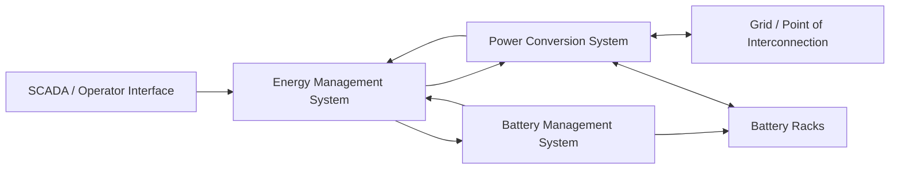

# BESS Control Flow

## Review Notes

- Define which system owns active/reactive power commands.
- Define which system owns battery protection limits.
- Define how alarms and trips propagate.
- Confirm whether remote commands are advisory, supervisory, or directly controlling.
