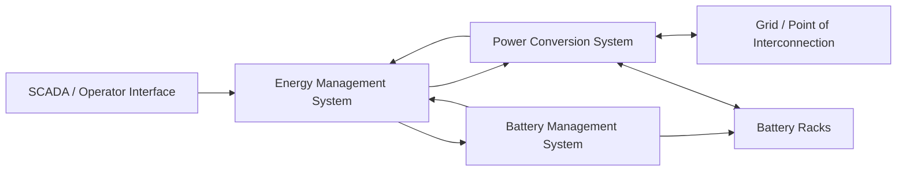

# BESS Control Flow

## Review Notes

- Define which system owns active/reactive power commands.
- Define which system owns battery protection limits.
- Define how alarms and trips propagate.
- Confirm whether remote commands are advisory, supervisory, or directly controlling.

## Signal Ownership Prompts

| Interface | Owner Prompt | Review Evidence |
|---|---|---|
| EMS to PCS | Who owns active power, reactive power, ramp-rate, and enable/disable commands? | EMS control narrative, PCS command list, dispatch test record. |
| EMS to BMS | Who owns SOC limits, availability state, and charge/discharge permission? | BMS interface control document, EMS logic description. |
| BMS to battery racks | Who owns rack-level protection, contactor state, and alarm escalation? | BMS cause-and-effect matrix, rack commissioning report. |
| SCADA to EMS | Which commands are operator requests versus direct control actions? | SCADA point list, operator procedure, command hierarchy. |
| Protection to PCS/EMS | Which trips bypass EMS logic and which events require controlled ramp-down? | Protection settings, trip matrix, functional test evidence. |

## Failure-Mode Review Questions

- What happens if EMS loses communication with PCS while a dispatch command is active?
- How does the system respond if BMS reports a rack unavailable while the EMS requests discharge?
- Which alarms are latched, which are advisory, and which force an automatic stop?
- Can SCADA still display system state if EMS is unavailable?
- Are protection trips recorded with enough timestamp detail to reconstruct the event sequence?
